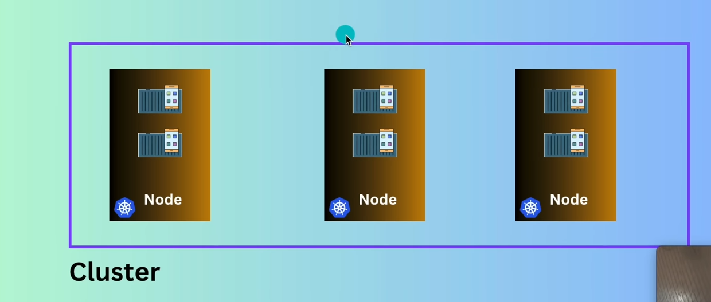
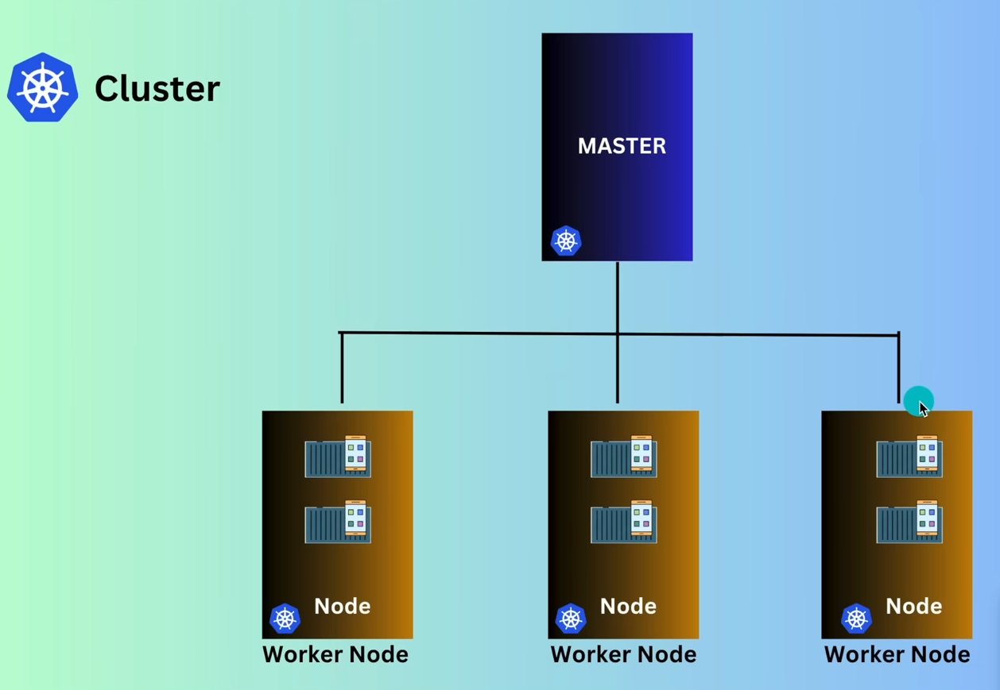
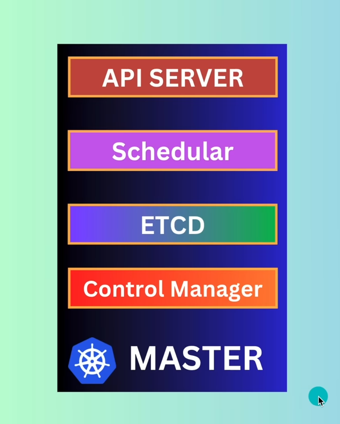
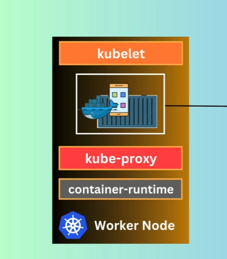
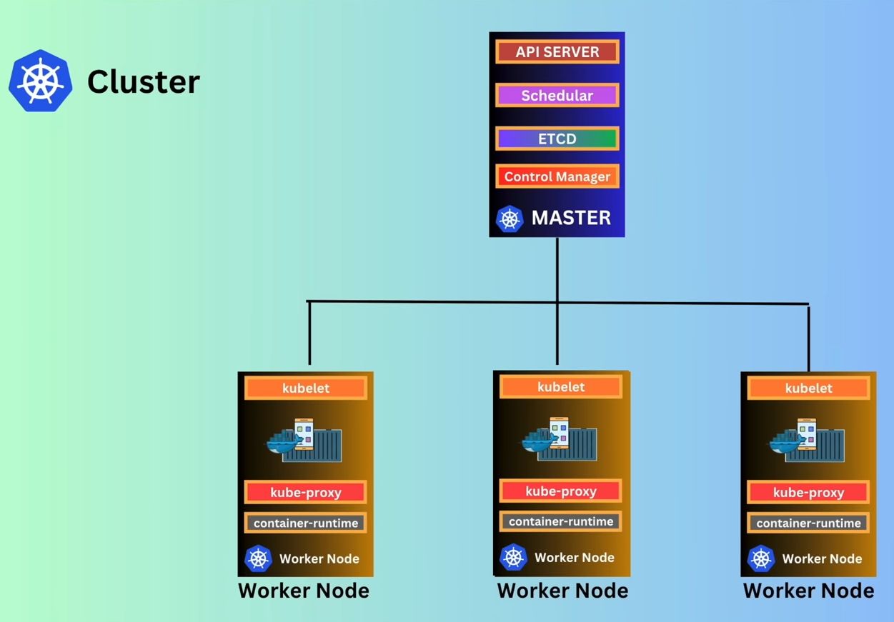
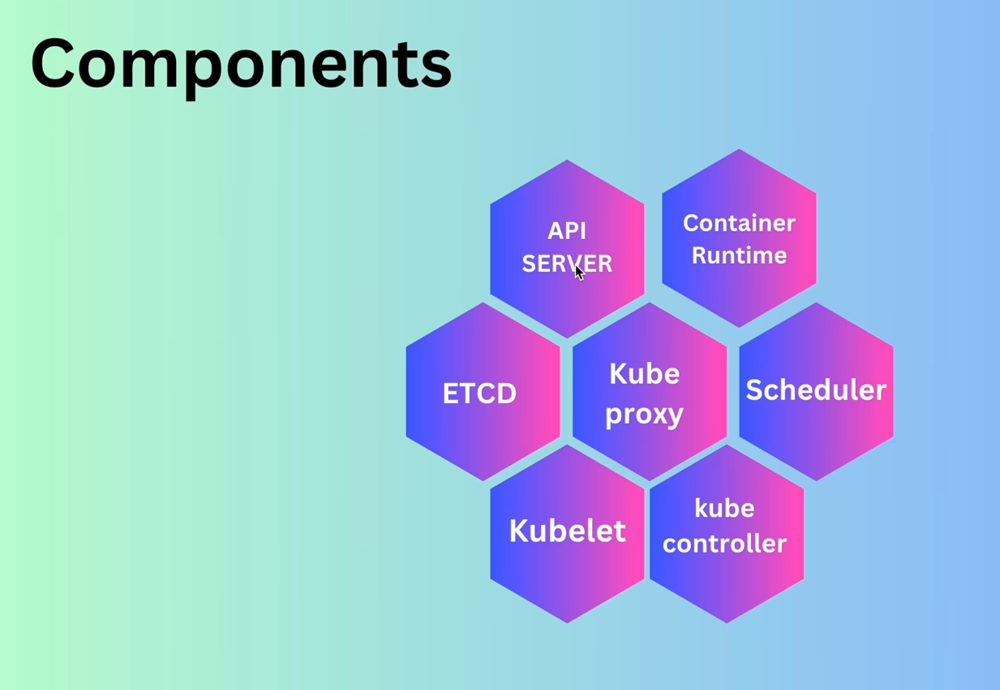
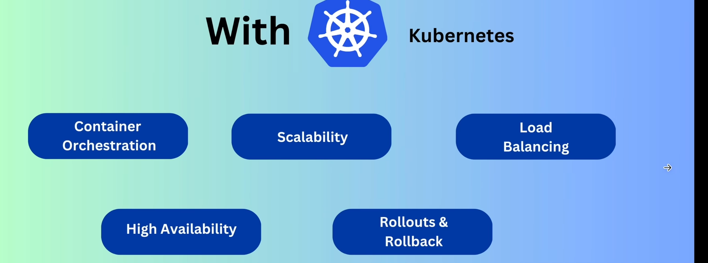

#  Kubernetes

---------------------------
* Kubernetes (often abbreviated as K8s) is an open-source container orchestration platform :
  * designed to automate the deployment, 
  * scaling, and 
  * management of containerized applications. 
* It was originally developed by Google and is now maintained by the Cloud Native Computing Foundation (CNCF).

-------------------------

#  Kubernetes as Orchestra

* Kubernetes  is  **MASTER**  of the orchestra, and the musicians are the **CONTAINERS** that play different instruments (services/applications).

-------------------

#  Why we need the Kubernetes ??

* We deploy our applications in containers , and we deploy our containers in the server.

* But when the no of users increases , we need to deploy our containers in multiple servers.

* So , it is difficult to manage our containers in multiple servers manually.

*  Here , Kubernetes comes into the picture. 

* Managing containerized applications at scale can be complex and challenging.

* Kubernetes provides a robust framework to run distributed systems resiliently.

* It takes care of scaling and failover for your applications, provides deployment patterns, and more.

------------------------

##  When we deploy the Kubernaties is called the cluster..

- important parts of the cluster:
  * Master Node (control plane)
  * Worker Node (server)

--------------------

##  Cluster : it is group of nodes (machines) that run containerized applications.

--------------------

##  Master Node : it is responsible for managing the cluster.

--------------------

##  Components of Kubernetes :

### - Master Node Components :
- **API Server** : The API server is a component of the Kubernetes control plane that exposes the Kubernetes API. It is the front-end for the Kubernetes control plane and is responsible for handling RESTful requests from users, clients, and other components within the cluster.

- **Scheduler** : The scheduler is a component of the Kubernetes control plane that is responsible for assigning pods to nodes in the cluster. It watches for newly created pods that have no node assigned and selects a node for them to run on based on resource availability, policies, and other constraints.

- **Controller Manager** : The controller manager is a component of the Kubernetes control plane that runs various controllers

- **etcd (key-value store)*** : etcd is a distributed key-value store that is used by Kubernetes to store all of its cluster data. It is a critical component of the Kubernetes control plane and provides a reliable way to store and retrieve configuration data, state information, and metadata about the cluster.

### - Worker Node Components :
  *  **Kubelet** : An agent that runs on each worker node in the Kubernetes cluster. It is responsible for ensuring that the containers are running in a Pod.

  * **Kube-Proxy** : A network proxy that runs on each worker node in the Kubernetes cluster. It is responsible for maintaining network rules on the nodes and enabling communication between Pods and Services.

  * **Container Runtime** (like Docker, container) 
    * it is the software that is responsible for running containers. Kubernetes supports several container runtimes, including Docker, container, and CRI-O.

  * **Pods** : The smallest and simplest Kubernetes object. A Pod represents a single instance of a running process in your cluster and can contain one or more containers.

  * **Services** : An abstraction that defines a logical set of Pods and a policy by which to access them. Services enable communication between different components of an application running in a Kubernetes cluster.

----------------------------------

------------------

## What is Pod in Kubernetes?

- A single instance of a running process in your cluster.
- Pods contain one or more containers, such as Docker containers.
- Pods are the smallest and simplest Kubernetes object.

----------------

##  Features of Kubernetes :

*  **Automated Rollouts and Rollbacks** : Kubernetes can automatically roll out changes to your application or its configuration, while monitoring the health of your application to ensure that it doesn't kill all your instances at the same time. If something goes wrong, Kubernetes can roll back the change for you.

* **High Availability** : 24/7 availability of applications by distributing them across multiple nodes in the cluster. If a node fails, Kubernetes automatically reschedules the affected pods to other healthy nodes.

* **Service Discovery and Load Balancing** : Kubernetes can expose a container using the DNS name or using their own IP address. If traffic to a container is high, Kubernetes is able to load balance and distribute the network traffic so that the deployment is stable.

* **Storage Orchestration** : Kubernetes allows you to automatically mount a storage system of your choice, such as local storage, public cloud providers, and more.

* **Self-Healing : Kubernetes** restarts containers that fail, replaces and reschedules containers when nodes die, kills containers that don't respond to your user-defined health check, and doesn't advertise them to clients until they are ready to serve.

* **Secrets and Configuration Management** : Kubernetes lets you store and manage sensitive information, such as passwords, OAuth tokens, and ssh keys. You can deploy and update secrets and application configuration without rebuilding your container images, and without exposing secrets in your stack configuration.

